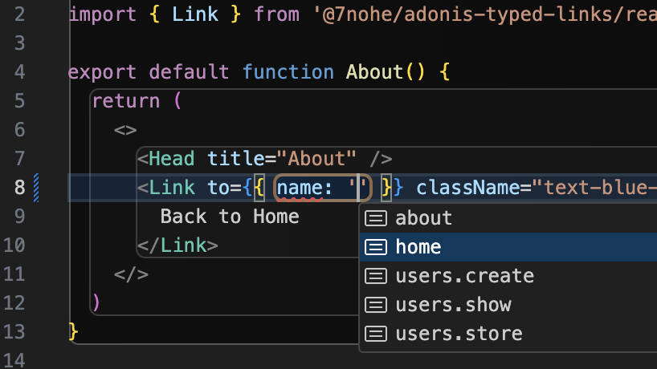

## AdonisJS Typed Links

Provides strongly-typed wrappers for Inertia.js's [Links](https://inertiajs.com/links), [Manual Visits](https://inertiajs.com/manual-visits), and [Form Helper](https://inertiajs.com/forms#form-helper) from AdonisJS routing.



## Installation

```bash
node ace add @7nohe/adonis-typed-links
```

## Usage

### Links

For example, if you have a route like this:

```ts
import router from '@adonisjs/core/services/router'

router.on('/').render('home').as('home')
router.on('/about').render('about').as('about')
router.on('/users/:id').render('users/show').as('users.show')
```

> [!IMPORTANT]
> You need to define the route name using the `as` method to make it work with the typed links.

You can use the `Link` component like this:

```tsx
import { Link } from '@7nohe/adonis-typed-links/react'

function MyComponent() {
  return (
    <div>
      {/* Strongly typed route name and parameters */}
      <Link to={{ name: 'home' }}>Home</Link>
      <Link to={{ name: 'about' }}>About</Link>
      <Link to={{ name: 'users.show', params: { id: 1 } }}>User 1</Link>
    </div>
  )
}
```

### Manual Visits

You can also use Inertia's visit/request methods with type safety:

```tsx
import { router } from '@7nohe/adonis-typed-links/react'

router.visit({ name: 'home' })
router.visit({ name: 'users.show', params: { id: 1 } })
router.post({ name: 'users.create' }, { username: 'john' })
```

You can make a request body type-safe by using the validation schema:

```ts
import vine from '@vinejs/vine'

export const createUserValidator = vine.compile(
  vine.object({
    username: vine.string().minLength(3).maxLength(255),
  })
)
```

```tsx
import { router } from '@7nohe/adonis-typed-links/react'
import { Infer } from '@vinejs/vine/types'
import { createUserValidator } from '#validators/user_validator'

router.post<'users.create', Infer<typof createUserValidator>>({ name: 'users.create' }, { username: 'john' })
```

### Form Helper

React:

```tsx
import { useForm } from '@7nohe/adonis-typed-links/react'

function MyComponent() {
  const form = useForm({
    username: '',
  })

  return (
    <form
      onSubmit={(e) => {
        e.preventDefault()
        form.post({ name: 'users.create' })
      }}
    >
      <input
        type="text"
        value={form.data.username}
        onChange={(e) => form.setData('username', e.target.value)}
      />
      <button type="submit">Submit</button>
    </form>
  )
}
```

Vue 3:

```vue
<script setup lang="ts">
import { useForm } from '@7nohe/adonis-typed-links/vue3'

const form = useForm({
  username: '',
})

const submit = () => {
  form.post({ name: 'users.create' })
}
</script>
<template>
  <form @submit.prevent="submit">
    <input v-model="form.username" />
    <button type="submit">Submit</button>
  </form>
</template>
```

## Examples

- [React](examples/react-app)
- [Vue 3](examples/vue3-app)
